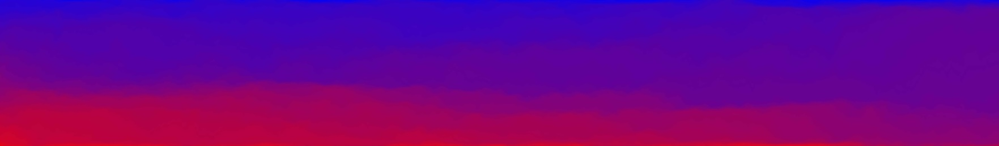

# Messengers: Breaking Echo Chambers in Collective Opinion Dynamics with Homophily

This repository contains all the code and resources accompanying the paper titled "Messengers: Breaking Echo Chambers in Collective Opinion Dynamics with Homophily." The preprint of the paper is available on arXiv [here](https://arxiv.org/abs/2406.06440).


## Table of Contents

- [Overview](#overview)
- [Paper Abstract](#paper_abstract)
- [Contents](#contents)
  - [Codes for Paper](#codesforpaper)
  - [Matlab Codes](#Matlabcodes)
  - [Julia Codes](#Juliacodes)
  - [Python Codes](#Pythoncodes)
- [Data Availability](#data)
- [Getting Started](#gettingstarted)
- [License](#license)
- [Contact](#contact)
- [Citation](#citation)


<a name="overview" />

## Overview

In the paper, we study the effect of homophily in collective opinion dynamics with spatial embedding and show that echo chambers emerge in low connectivity regimes. We also introduce Messenger as a solution to break echo chambers. This repository provides all necessary codes to replicate our study, including simulation, post-processing, and visualization scripts.


<a name="paper_abstract" />

## Paper Abstract

Here is the abstract of the paper:
Collective estimation is a variant of collective decision-making, where agents need to achieve consensus on a continuous quantity in a self-organized fashion via social interactions. A particularly challenging scenario is a fully distributed collective estimation with strongly constrained, dynamical interaction networks, for example, encountered in real physical space. In such cases, agents first need to explore a spatially distributed signal through movement, then reach a consensus while being able to communicate only with nearby neighbors. Collectives face several challenges in achieving precise estimation consensus, particularly due to complex behaviors emerging from the simultaneous evolution of the agents' opinions and the interaction network. While homophilic networks may facilitate collective estimation in well-connected networks, we show that disproportionate interactions with like-minded neighbors lead to the emergence of echo chambers, preventing collective consensus. Our agent-based simulation results confirm that, besides a lack of exposure to attitude-challenging opinions, seeking reaffirming information entraps agents in echo chambers. In a potential solution, agents can break free from the pull of echo chambers. We suggest an additional state where stubborn mobile agents (called Messengers) carry data and connect the disconnected clusters by physically transporting their opinions to other clusters to inform and direct the other agents. However, an agent requires a switching mechanism to determine which state to adopt. We propose a generic, novel approach based on a Dichotomous Markov Process (DMP). We show that a wide range of collective behaviors arise from the DMP. We study a continuum between task specialization with no switching (full-time Messengers), generalization with slow switching (part-time Messengers), and rapid task switching (short-time Messengers). Our results show that stubborn agents can, in various ways, help the collective escape local minima, break the echo chambers, and promote consensus in collective opinion dynamics.

<a name="contents" />

## Contents

You can find all the codes we used to generate the data from the agent-based simulations, and to post-process and visualize the figures of the paper in the [codes for paper](/codes_for_paper) folder. We also provided separate codes for single agent-based simulation in 3 different programming languages to enhance the accessibility of the simulations. We originally developed the code in [Matlab](#Matlabcodes), and a 1-dimensional case in [Julia](#Juliacodes). We are developing a recent translation of the codes in [Python](#Pythoncodes).


<a name="Matlabcodes" />

### Matlab Codes


<a name="Juliacodes" />

### Julia Codes


<a name="Pythoncodes" />

### Python Codes

[This folder](/Python_test) contains the codes to run a sample simulation of the model in Python. 
For further information on how to set up the environment, please check the readme.md file in the folder.


<a name="codesforpaper" />

### Codes for Paper
Please find them in the [codes_for_paper](/codes_for_paper) folder.


<a name="data" />

## Data Availability
The datasets generated and analyzed during the current study are available in [this](https://depositonce.tu-berlin.de/handle/11303/22195) repository. This dataset is needed to regenerate the figures of the paper. When you download the file, you can find a brief instruction on how to visualize the main result (Figure 5) in the readme.md file. 


<a name="gettingstarted" />

## Getting Started


<a name="license" />

## License


<a name="contact" />

## Contact


<a name="citation" />

## Citation

If you use this software and the dataset in your research, please cite our work as following:

[1] Raoufi, M., Hamann, H., & Romanczuk, P. (2024). Messengers: Breaking Echo Chambers in Collective Opinion Dynamics with Homophily. arXiv preprint arXiv:2406.06440. 

[2] Raoufi, M., Hamann, H., & Romanczuk, P. (2024). Simulation Dataset: Breaking Echo Chambers in Collective Opinion Dynamics with Homophily.

bibTex format:

```
@article{raoufi2024messengers,
  title={Messengers: Breaking Echo Chambers in Collective Opinion Dynamics with Homophily},
  author={Raoufi, Mohsen and Hamann, Heiko and Romanczuk, Pawel},
  journal={arXiv preprint arXiv:2406.06440},
  year={2024}
}

@article{raoufi2024simulation,
  title={Simulation Dataset: Breaking Echo Chambers in Collective Opinion Dynamics with Homophily},
  author={Raoufi, Mohsen and Hamann, Heiko and Romanczuk, Pawel},
  year={2024}
}
```


